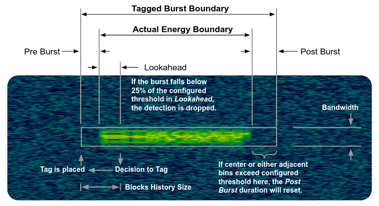
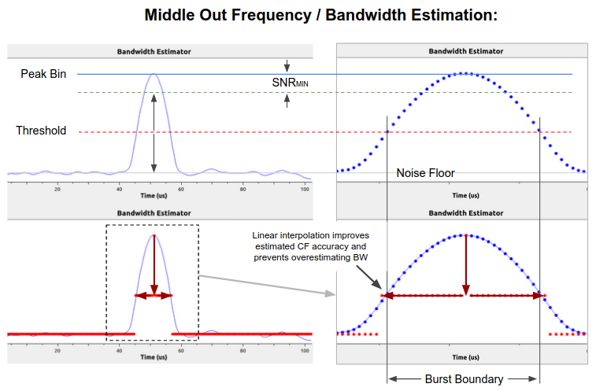

## GNU Radio FHSS Utilities

This GNU Radio module contains tools for processing frequency hopping spread spectrum signals. Blocks derived from the gr-iridium project exist to detect narrowband bursts within wideband signals and downconvert and center them. Metadata is tracked through this process enabling reconstruction of where the bursts originated in time and frequency. Another set of blocks exists to baseband all bursts within a high fidelity signal capture which is useful for reverse engineering of FHSS datasets.

---

### General Concept of High Fidelity FHSS Signal Dehopping

The dataset dehopper blocks were designed to quickly allow for good accuracy dehopping of high fidelity FHSS FSK recordings. This is accomplished by a two-stage dehopping process by which a coarse FFT is taken and peak values are taken by a simple sample-and-hold block when an amplitude threshold is crossed, then a second stage does fine frequency correction by taking an instantaneous frequency average. This works well for FSK signals but requires some work for other signals.

This has been implemented without use of OOT DSP, though the module has python hier blocks that are installed with the build. Alternately there are GRC hier blocks located in the _gr-fhss_utils/examples/hier_blocks/_ directory

---

### General Concept of the FFT Burst Detector

This block is a fast energy detector that processes a stream of complex data and will apply stream tags to identify the start, end, and approximate frequency of detected bursts of energy.

Internally this block processes data one FFT at a time. It maintains a dynamic noise floor estimate for each bin over the prior `history_size` FFTs, and compares incoming FFT bins to see if they are `threshold` dB above the moving noise floor estimate. Once detected, potential bursts are observed to ensure they remain above the threshold for at least `lookahead` FFTs, after which they are tracked as detections and tagged; bursts that are shorter than this duration are likely to be charachterized as noise and ignored.

 Burst tags can be applied before / after the detected start / end of burst using the `burst_pre_len` and `burst_post_len` options respectively. End of burst tags are appended once the value of the center burst bin or either adjacent bin is gone for `burst_post_len` FFTs, so it is recommended to set this value to some nonzero number to reduce the chance a burst end is tagged too early. If this value is set too long, multiple bursts may be combined into one burst.

 Debug information including detected peak value files (saved in /tmp) and a complex PDU suitable for display on the in-tree QT Time Sink of FFTs and dynamic threshold can be endabled for debugging, but it is not recommended for normal operation as these take a non-trivial amount of compute cycles. Deeper level debug information can be enabled using compile options in the source.

---

### Middle Out Frequency and Bandwidth Estimation

The center frequency estimation block contains an otherwise undocumented method for burst frequency boundary detection that is useful for accurate center frequency and bandwidth estimation of high fidelity signals. The noise floor estimate from the FFT burst tagger and user specified minimum signal to noise ratio is used to determine the threshold (halfway between these values) for burst edges, coupled with the narrow Gaussian window used by this block results in good definition many signal types. This method is depicted below:

---

An overview of the Sandia National Laboratories Utilities GR Modules can be found in the README for https://github.com/sandialabs/gr-pdu_utils
